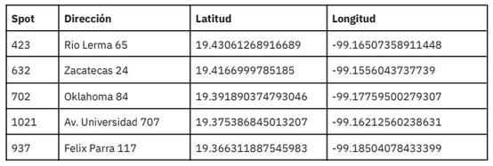
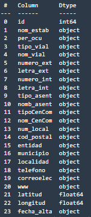
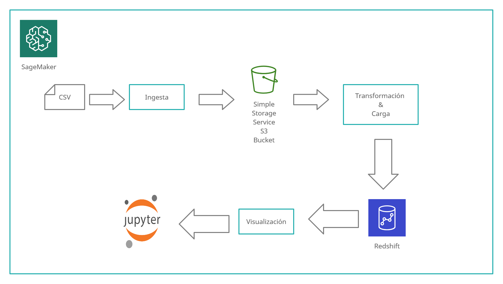

# GeoData
GeoData es un repositorio para la ingesta, transformación y carga de una fuente de datos abiertos (INEGI) de comercio al pormenor y comercio al por mayor

## Stack tecnológico
* AWS SageMaker
* AWS RedShift
* JupyterNotebooks
* AWS S3

## Descripción del Problema
Definir una estrategia de extracción, procesamiento y almacenamiento que respondan a las necesidades del equipo y solucione la infraestructura de ingesta y consulta de datos para cualquier manipulación requerida por el resto de los miembros de la organización.
Para esto, un cliente ha confiado en spot2 como aliado para abrir su próximo negocio, una pizzería en la ciudad de México. Se han levantado los requerimientos y tenemos una lista de spots disponibles que se ajustan a estos:

Por cada spot, nos gustaría saber cuántas pizzerías hay en un radio de 500 m., 1 km y 3 km, además
de poder consultar el nombre de cada una de estas pizzerías y su tamaño en fuerza laboral
(número de empleados) de los últimos 3 años. Para esto te pedimos extraer la información que
ofrece el Directorio Estadístico Nacional de Unidades Económicas (DENUE) sobre el comercio al por
menor en México, procesa, limpia y manipula la data hasta el punto que lo creas conveniente para
luego implementar una función que calcule la distancia entre el spot y las pizzerías dentro de los
radios solicitados.

## Datos
Del universo de datos que el INEGI provee en su página (https://www.inegi.org.mx/app/descarga/?ti=6) se tomarón para este ejercicio los siguientes:

Comercio al por mayor
Comercio al por menor (1 de 4)
Comercio al por menor (2 de 4)
Comercio al por menor (3 de 4)
Comercio al por menor (4 de 4)

### Diseño Final para los datos en RedShift

## Flujo del Pipeline
De momento cada uno de los pasos se ejecuta de forma manual pero se puede mejorar el proyecto utilizando los Pipelines que proporciona SageMaker

